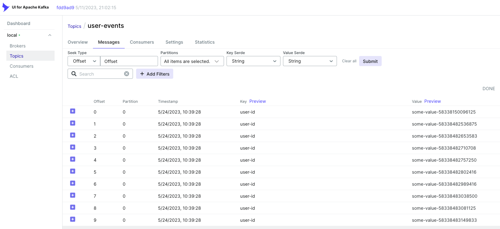

# Developing Kafka Applications - Producer API

In this lab, you will create a Kafka Producer using the Java API. The next lab will be the creation of the Kafka
Consumer so that you can see an end to end example using the API.

## Objectives

1. Create topics on the Kafka server for the producer to send messages
2. Understand what the producer Java code is doing
3. Build & package the producer
4. Run the producer

## Prerequisites

Like the previous lab, [Docker](https://www.docker.com) will be used to start a Kafka and Zookeeper server. We will also
use a [Maven Docker image](https://hub.docker.com/_/maven) to compile & package the Java code and
an [OpenJDK image](https://hub.docker.com/_/openjdk) to run it.

You should have a text editor available with Java syntax highlighting for clarity. You will need a basic understanding
of Java programming to follow the lab although coding will not be required. The Kafka Producer example will be explained
and then you will compile and execute it against the Kafka server.

## Instructions

All the directory references in this lab is relative to where you expended the lab files
and `labs/02-Understand-kafka-basic`

1. Open a terminal in this lesson's root directory.

2. Start the Kafka and Zookeeper containers using Docker Compose:

    ```
    $ docker-compose up
    ```

    Access kafka-client client `http://localhost:7070/` and connect to kafka clusfer with the BootStrap Servers `kafka:9093`:

    

3. Open an additional terminal window in the lesson directory.

4. Open [`Producer.java`](../2.0-solution/producer-consumer/src/main/java/app/producer/Producer.java) in your text editor. This class is fairly simple Java application but contains all the functionality necessary to operate as a Kafka Producer. The application has two main
   responsibilities:

    * Initialize and configure
      a [KafkaProducer](http://kafka.apache.org/0100/javadoc/org/apache/kafka/clients/producer/KafkaProducer.html)
    * Send messages to topics with the `KafkaProducer` object

   To create our producer object, we must create an instance of `org.apache.kafka.clients.producer.KafkaProducer` which
   requires a set of properties for initialization. While it is possible to add the properties directly in Java code, a
   more likely scenario is that the configuration would be externalized in a properties file.

   Open [`producer.properties`](../2.0-solution//producer-consumer/src/main/resources/producer.yaml) and you can see that the configuration is minimal.

    * `acks` is the number of acknowledgments the producer requires the leader to have received before considering a
      request complete. This controls the durability of records that are sent. A setting of `all` is the strongest
      guarantee available.
    * Setting `retries` to a value greater than 0 will cause the client to resend any record whose send fails with a
      potentially transient error.
    * `bootstrap.servers` is our required list of host/port pairs to connect to Kafka. In this case, we only have one
      server. The Docker Compose file exposes the Kafka port so that it can be accessed through `localhost`.
    * `key.serializer` is the serializer class for key that implements the `Serializer` interface.
    * `value.serializer` is the serializer class for value that implements the `Serializer` interface.
    * `boostrap.servers.docker` is only used if we detect that the code is running inside a Docker container.

   There are
   [many configuration options available for Kafka producers](http://kafka.apache.org/documentation.html#producerconfigs)
   that should be explored for a production environment.

5. Once you have a `KafkaProducer` instance, you can post messages to a topic using
   the [`ProducerRecord`](http://kafka.apache.org/0100/javadoc/org/apache/kafka/clients/producer/ProducerRecord.html).
   A `ProducerRecord` is a key/value pair that consists of a topic name to which the record is being sent, an optional
   partition number, an optional key, and required value.

   In our lab, we are going to send a bunch of messages in a loop. Each iteration of the loop will consist of sending a
   message to the `user-events` topic with a key/value pair. Every so often, we also send a randomized message to
   the `global-events` topic. The message sent to `global-events` does not have a key specified which normally means
   that Kafka will assign a partition in a round-robin fashion but our topic only contains 1 partition.

   After the loop is complete, it is important to call `producer.close()` to end the producer lifecycle. This method
   blocks the process until all the messages are sent to the server. This is called in the `finally` block to guarantee
   that it is called. It is also possible to use a Kafka producer in
   a [try-with-resources statement](https://docs.oracle.com/javase/tutorial/essential/exceptions/tryResourceClose.html).

6. Now we are ready to compile the lab. In a terminal, change to the lab's `producer` directory and run the class [`Producer.java`](../2.0-solution/producer-consumer/src/main/java/app/producer/Producer.java)
   
    
    

7. *Don't* stop the Kafka and Zookeeper servers because they will be used in the next lab focusing on the Consumer API.

### Conclusion

We have now successfully sent a series of messages to Kafka using the Producer API. In the next lab, we will write a
consumer program to process the messages from Kafka.

Congratulations, this lab is complete!